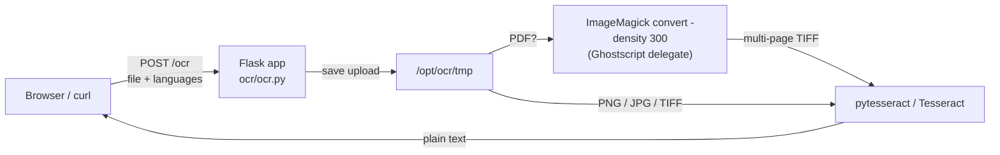

# OCR-Docker
## Extract text from images & PDF files

[](https://hub.docker.com/r/techblog/ocr-docker)
[](https://hub.docker.com/r/techblog/ocr-docker/tags)
[](LICENSE)

OCR-Docker is a small, easy-to-use web app, powered by Python and [Flask](https://flask.palletsprojects.com/), that helps us extract text from images and PDF files in multiple languages. Upload a file in the browser (or `POST` it with `curl`), pick a language, and get the recognized text back as plain text.

The OCR (Optical Character Recognition) itself is free thanks to [tesseract-ocr](https://github.com/tesseract-ocr/), an open-source OCR engine. The Docker image bundles Tesseract, the extra language models from this repository, and everything needed to convert PDFs, so there is nothing else to install.

## Table of Contents

- [Features](#features)
- [Screenshot](#screenshot)
- [How it works](#how-it-works)
- [Requirements](#requirements)
- [Installation](#installation)
- [Configuration](#configuration)
- [Usage](#usage)
- [Supported languages](#supported-languages)
- [Troubleshooting](#troubleshooting)
- [Security notes](#security-notes)
- [Development](#development)
- [Contributing](#contributing)
- [Credits](#credits)
- [License](#license)

## Features

- Extract text from images (`png`, `jpg`, `tiff`).
- Extract text from PDF files (single or multiple pages). Every page is OCR'd and the results are joined in page order.
- Multi-page TIFF support: every frame is OCR'd.
- Language selection: the web UI lists every language Tesseract finds in the container, so adding a `.traineddata` file adds a language.
- Simple web UI (upload, pick a language, read the result) and a plain HTTP endpoint for scripts and automations.
- Ships as a ready-to-run Docker image (`techblog/ocr-docker`) with 19 bundled Tesseract models (15 languages and 4 scripts) on top of English.

## Screenshot

[](https://github.com/t0mer/ocr-docker/blob/main/screenshot/ocr.png?raw=true "OCR")

## How it works



1. The browser loads `/`, which calls `GET /languages` to fill the language drop-down with the languages Tesseract reports (`pytesseract.get_languages()`).
2. **Run OCR** posts the form (`file` + `languages`) to `POST /ocr`.
3. The upload is saved to `/opt/ocr/tmp` under its lower-cased original file name.
4. PDFs are converted to a multi-page TIFF with ImageMagick (`convert -density 300 … -background white -alpha Off`), which uses Ghostscript to render PDFs. The Dockerfile edits `/etc/ImageMagick-6/policy.xml` to allow PDF reading and writing, which Ubuntu's ImageMagick blocks by default. The app then waits a fixed 5 seconds, so every PDF request takes at least that long. The original PDF is deleted after conversion.
5. TIFF files are OCR'd frame by frame with `--psm 6` (a single uniform block of text); PNG/JPG files are OCR'd as a single image with Tesseract's default page segmentation.
6. The recognized text is returned in the response body.

## Requirements

- **Docker** (recommended): Docker Engine, plus Docker Compose if you use the compose file. The published image is `linux/amd64` only.
- **From source**: Python 3, Tesseract OCR 5, ImageMagick and Ghostscript, plus the Python packages listed under [Development](#development).

No API keys or external services are needed; everything runs locally.

## Installation

### Docker Compose (from Docker Hub)

This is the `docker-compose.yaml` shipped in the repository:

```yaml
version: "3.7"
services:
  ocr:
    image: techblog/ocr-docker:latest
    ports:
      - "8080:8080"
    container_name: tts-stt
    labels:
      - "com.ouroboros.enable=true"
    networks:
      - default
    restart: unless-stopped
```

> The `container_name` (`tts-stt`) is a leftover from another project; rename it to something like `ocr-docker` if you prefer. The `com.ouroboros.enable` label only matters if you run [Ouroboros](https://github.com/pyouroboros/ouroboros) for automatic image updates. Newer Docker Compose versions ignore the top-level `version` key.

Now, run `docker compose up -d` (or `docker-compose up -d` with Compose v1) to pull and run your container.
Open your browser and navigate to your container's IP address on port 8080 (e.g. `http://localhost:8080`); you should see the screen shown [above](#screenshot).

### Docker

```bash
docker run -d --name ocr-docker -p 8080:8080 --restart unless-stopped techblog/ocr-docker:latest
```

Published tags on Docker Hub: `latest`, `1.0.1` and `1.0.0` (all `linux/amd64`). The `VERSION` file in the repository says `1.1.1`, but no image with that tag has been published yet.

### Build the image yourself

```bash
git clone https://github.com/t0mer/ocr-docker.git
cd ocr-docker
docker build -t ocr-docker .
docker run -d -p 8080:8080 ocr-docker
```

The image is based on `ubuntu:20.04`, installs Tesseract from the [`alex-p/tesseract-ocr-devel`](https://launchpad.net/~alex-p/+archive/ubuntu/tesseract-ocr-devel) PPA, and copies the `traineddata/` folder into `/usr/share/tesseract-ocr/5/tessdata`.

### From source (without Docker)

The app has hard-coded paths that match the Docker image, so running it outside Docker needs the same layout:

```bash
# Ubuntu/Debian example
sudo apt install tesseract-ocr ghostscript imagemagick python3-venv

# Use a virtual environment (newer distros block system-wide pip installs, PEP 668)
python3 -m venv .venv
. .venv/bin/activate
pip install flask flask_restful loguru pytesseract Pillow pyyaml

# Uploads are written here; the directory must exist
sudo mkdir -p /opt/ocr/tmp && sudo chown "$USER" /opt/ocr/tmp

# Optional: extra languages. Copy them into your tessdata folder,
# /usr/share/tesseract-ocr/<version>/tessdata (e.g. 4.00 or 5).
# `tesseract --list-langs` prints the exact path on its first line.
TESSDATA=$(tesseract --list-langs 2>&1 | head -n1 | sed 's/.*"\(.*\)".*/\1/')
sudo cp traineddata/*.traineddata "$TESSDATA/"

cd ocr
python3 ocr.py
```

Make sure your ImageMagick policy allows PDF files (see step 4 of [How it works](#how-it-works)), otherwise PDF conversion fails.

## Configuration

There are no environment variables, config files or command-line flags. Everything is set in `ocr/ocr.py` and the `Dockerfile`:

| Setting | Value | Where | Notes |
|---|---|---|---|
| Listen address / port | `0.0.0.0:8080` | `ocr/ocr.py` (`app.run`) | Change the published port with Docker (`-p 9000:8080`). |
| Upload folder | `/opt/ocr/tmp` | `ocr/ocr.py` (`UPLOAD_FOLDER`), created in the `Dockerfile` | Must exist and be writable. |
| Allowed file types | `png`, `jpg`, `pdf`, `tiff` | `ocr/ocr.py` (`allowed_file`) | The extension is checked with a substring test against the string `png,jpg,pdf,tiff`, so some variants pass (e.g. `.tif`) and others are rejected (e.g. `.jpeg`). |
| Upload size limit | none | — | Flask's `MAX_CONTENT_LENGTH` is not set. |
| PDF render resolution | 300 DPI | `ocr/ocr.py` (`convert_to_tiff`) | |
| Tesseract options | `--psm 6` for TIFF/PDF, defaults for PNG/JPG | `ocr/ocr.py` | |
| Language models | `/usr/share/tesseract-ocr/5/tessdata` | `Dockerfile` | Mount or copy extra `.traineddata` files here. |
| Flask debug mode | on | `ocr/ocr.py` (`debug=True`) | See [Security notes](#security-notes). |
| Logging | stderr (Loguru defaults) | `ocr/ocr.py` | View with `docker logs <container>`. |
| Locale | `PYTHONIOENCODING=utf-8`, `LANG=C.UTF-8` | `Dockerfile` | |

### Adding languages

The language list is read from Tesseract at request time, so you can add a language without rebuilding the image by mounting a model into the tessdata folder, for example:

```yaml
    volumes:
      - ./por.traineddata:/usr/share/tesseract-ocr/5/tessdata/por.traineddata:ro
```

Models are available in the [tessdata](https://github.com/tesseract-ocr/tessdata) repository (also [tessdata_fast](https://github.com/tesseract-ocr/tessdata_fast) and [tessdata_best](https://github.com/tesseract-ocr/tessdata_best)).

## Usage

### Web UI

1. Open `http://<host>:8080`.
2. Click **Browse…** and select a `png`, `jpg`, `tiff` or `pdf` file.
3. Choose the language from **Select OCR Language**.
4. Click **Run OCR**. A "Working, it may take a while..." spinner is shown; PDFs take longer because of the conversion step and a fixed 5-second wait after it.
5. The recognized text appears in the **Result** box.

### API

| Method | Path | Purpose |
|---|---|---|
| `GET` | `/` | Web UI. |
| `GET` | `/languages` | JSON array of the language codes Tesseract has installed. |
| `POST` | `/ocr` | Run OCR on an uploaded file and return the text. |
| `GET` | `/js/<path>`, `/css/<path>` | Static assets for the UI. |

#### `GET /languages`

```bash
curl http://localhost:8080/languages
```

```json
["Arabic", "Greek", "Hebrew", "Japanese", "afr", "ara", "bel", "deu", "deu_frak", "eng", "fin", "fra", "heb", "ind", "isl", "ita", "jpn", "osd", "rus", "spa", "swe"]
```

(The exact list and order depend on the models installed in the container.)

#### `POST /ocr`

`multipart/form-data` with two fields:

| Field | Required | Description |
|---|---|---|
| `file` | yes | The image or PDF to process (`png`, `jpg`, `tiff`, `pdf`). |
| `languages` | yes | A language code from `GET /languages`, e.g. `eng` or `heb`. The value is passed to Tesseract as-is. |

```bash
curl -F "file=@invoice.pdf" -F "languages=eng" http://localhost:8080/ocr
```

The response body is the recognized text (served with Flask's default `text/html` content type). For TIFF and PDF input, each page's text is followed by a newline.

Validation messages are also returned as plain text with HTTP 200, so check the body:

| Response body | Cause |
|---|---|
| `Data posted does not contains files` | `languages` is present but there is no `file` field. |
| `The file type you uploaded is not supported` | The file extension is not one of the allowed types. |
| `Please select OCR Language` | `languages` is empty. |

The `languages` field is read before anything else is checked, so a request without it (including one missing both fields) returns HTTP 400 (Bad Request).

The `languages` value is passed straight to Tesseract's `-l` option without validation, so Tesseract's `+` syntax for combining languages (for example `languages=heb+eng`) works through the API when all the named models are installed. The UI only sends one language.

## Supported languages

The image includes English (`eng`) and orientation/script detection (`osd`) from the Ubuntu Tesseract packages, plus these models from the [`traineddata/`](traineddata) folder:

| Code | Language | Code | Language |
|---|---|---|---|
| `afr` | Afrikaans | `ind` | Indonesian |
| `ara` | Arabic | `isl` | Icelandic |
| `bel` | Belarusian | `ita` | Italian |
| `deu` | German | `jpn` | Japanese |
| `deu_frak` | German (Fraktur) | `rus` | Russian |
| `fin` | Finnish | `spa` | Spanish |
| `fra` | French | `swe` | Swedish |
| `heb` | Hebrew | | |

Script models (recognize any language written in that script): `Arabic`, `Greek`, `Hebrew`, `Japanese`.

## Troubleshooting

- **The file type is rejected.** The extension check is a substring test against the string `png,jpg,pdf,tiff`, not an exact match. `.jpeg` is rejected, so rename it to `.jpg`. `.tif` passes the check but is not handled as a TIFF, so only its first page is read; rename it to `.tiff` to OCR every page.
- **PDF conversion fails or returns nothing.** The image relies on ImageMagick's policy allowing PDFs and on Ghostscript. If you build your own image or run from source, check `/etc/ImageMagick-6/policy.xml` for `rights="none" pattern="PDF"`. Large PDFs at 300 DPI can take a long time and a lot of memory.
- **The language drop-down is empty or a language is missing.** The list comes from `tesseract --list-langs`; make sure the `.traineddata` file is in `/usr/share/tesseract-ocr/5/tessdata` and readable.
- **Errors in the UI show no message.** The UI does not display HTTP errors (for example a 500 from Tesseract); check `docker logs <container>` for the Flask/Loguru output.
- **Two uploads with the same file name clash.** Uploads are stored by their original file name, so concurrent requests with the same name overwrite each other. Use unique file names when scripting.
- **Disk usage grows over time.** Uploaded images and converted TIFFs are kept in `/opt/ocr/tmp` (only the original PDF is deleted). Clean the folder periodically, or recreate the container.

## Security notes

- The app has **no authentication**. Anyone who can reach port 8080 can upload files and run OCR. Run it on a trusted network or behind a reverse proxy with authentication, and don't expose it directly to the internet.
- It accepts and processes **arbitrary uploaded files**, with no size limit, and stores them on disk. Treat uploads as untrusted input, and limit request sizes at the reverse proxy.
- Flask runs its **development server with debug mode enabled**. It is not meant for production or public exposure.
- Uploaded documents stay in `/opt/ocr/tmp` inside the container; remove them if they contain sensitive data.

## Development

Project layout:

```
ocr/
  ocr.py              # Flask app: routes, upload handling, PDF conversion, OCR
  templates/index.html
  css/ js/ fonts/     # UI assets (Bootstrap 4 and jQuery are loaded from CDNs)
traineddata/          # extra Tesseract models copied into the image
screenshot/ocr.png
Dockerfile
docker-compose.yaml
VERSION               # image version tag used by the Docker Build workflow
```

Python packages used (installed unpinned in the `Dockerfile`): `flask`, `flask_restful`, `loguru`, `pytesseract`, `Pillow`, `pyyaml` (plus `cryptography` and `Image`). There is no `requirements.txt` and no test suite.

Run locally with Docker while developing:

```bash
docker build -t ocr-docker:dev .
docker run --rm -p 8080:8080 ocr-docker:dev
```

GitHub Actions workflows (`.github/workflows/`):

| Workflow | Trigger | What it does |
|---|---|---|
| `docker-image.yml` (Docker Build) | manual | Builds `linux/amd64` and pushes `techblog/ocr-docker:latest` and `techblog/ocr-docker:<VERSION>` to Docker Hub. |
| `publish-ghcr.yml` (Publish to GHCR) | manual, optional `tag` input | Builds `linux/amd64`, `linux/arm64`, `linux/arm/v7` and pushes `ghcr.io/t0mer/ocr-docker:<tag>` and `:latest`. It has not been run yet, so no GHCR image exists. |
| `sonarcloud.yml` (SonarCloud) | push to `main`, pull requests, manual | SonarCloud code analysis (`techblog_ocr-docker`). |

## Contributing

Issues and pull requests are welcome. Please keep changes focused, describe how you tested them, and make sure the Docker image still builds.

## Credits

Components and frameworks used in OCR-Docker:

* [tesseract-ocr](https://github.com/tesseract-ocr/) - open-source OCR engine (Apache-2.0)
* [tessdata](https://github.com/tesseract-ocr/tessdata) - Tesseract OCR language models (Apache-2.0); the files in `traineddata/` come from here
* [Ghostscript](https://www.ghostscript.com/)
* [ImageMagick](https://imagemagick.org/index.php)
* [pytesseract](https://pypi.org/project/pytesseract/)
* [Pillow](https://pypi.org/project/Pillow/)
* [Image](https://pypi.org/project/image/)
* [Flask](https://flask.palletsprojects.com/)
* [Flask-RESTful](https://pypi.org/project/Flask-RESTful/)
* [Loguru](https://pypi.org/project/loguru/)
* [PyYAML](https://pypi.org/project/PyYAML/)
* [Bootstrap](https://getbootstrap.com/) and [jQuery](https://jquery.com/) for the web UI

## License

This project is licensed under the [Apache License 2.0](LICENSE).
